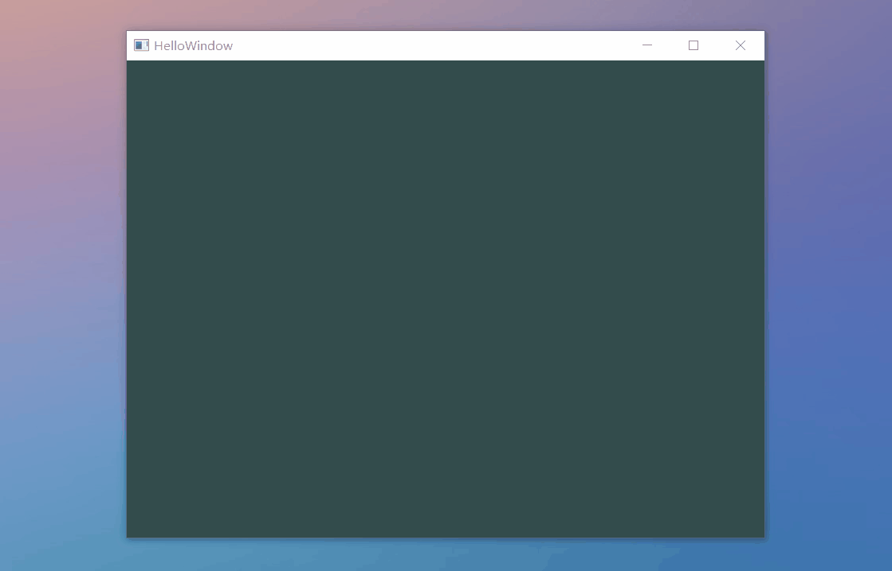
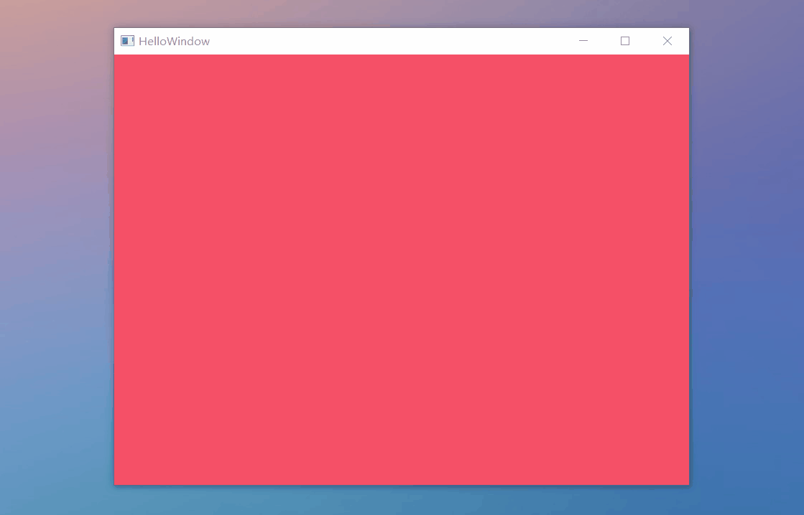
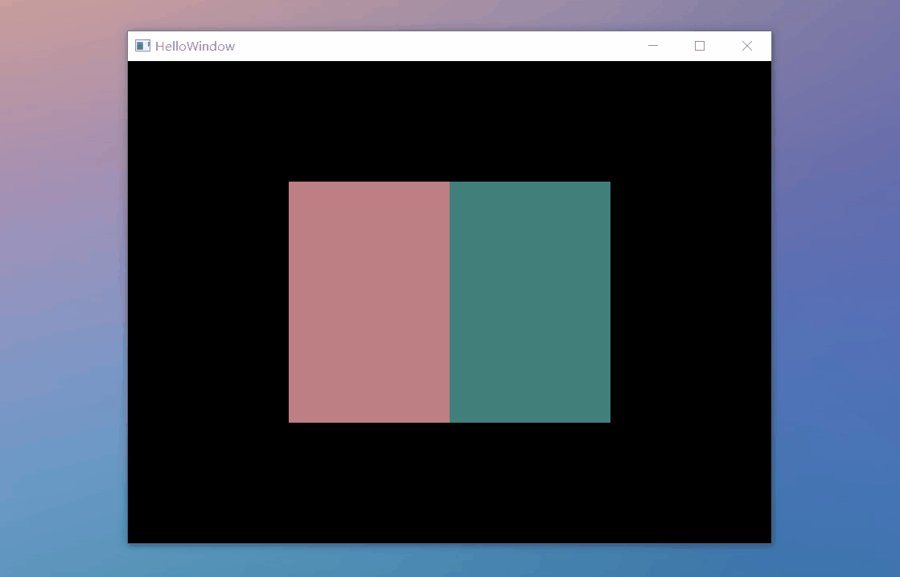
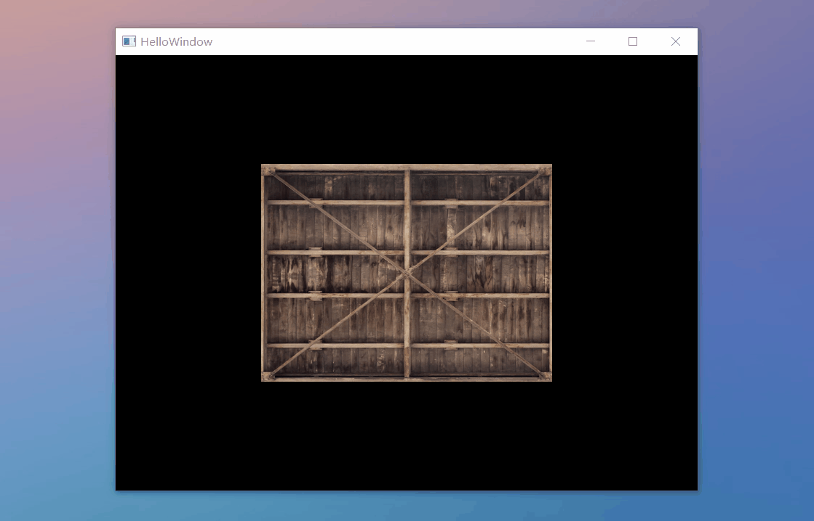
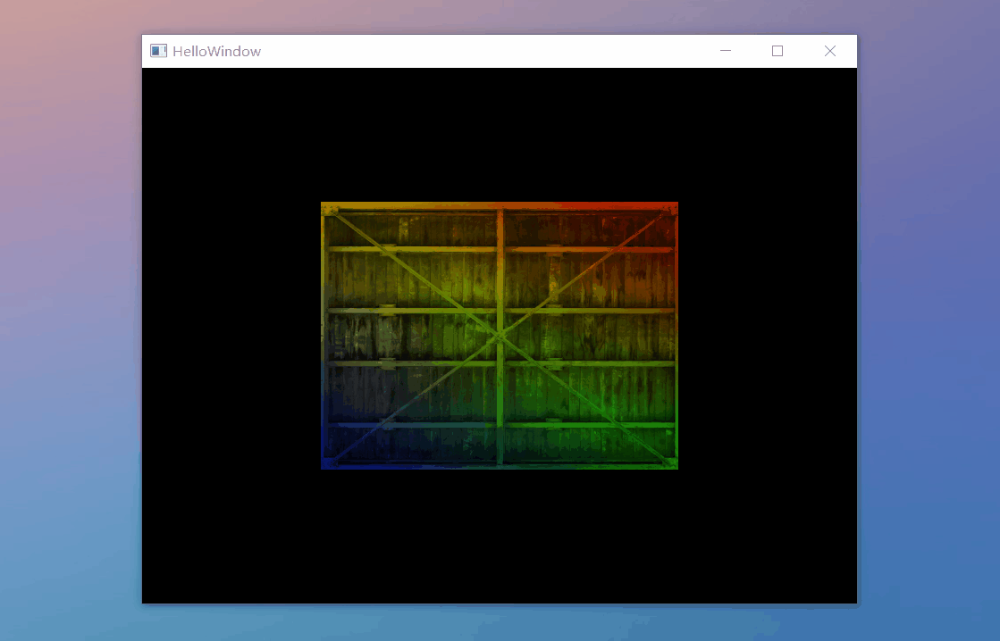
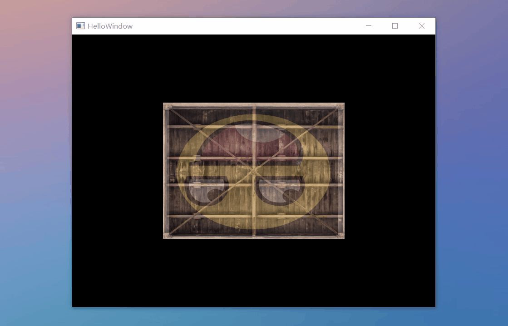

# OpenGl Lessons

## Lesson 1: Getting Started

| |  |  |
|:---:|:---:|:---:|
|  `HelloWindow.cpp` |  `HelloWindow2.cpp`   |
|  `HelloTriangle.cpp` |   `HelloShader.cpp`   |
|  `HelloTexture.cpp` |  `HelloTexture.cpp` |  `HelloTexture2.cpp` |
| | | |

  