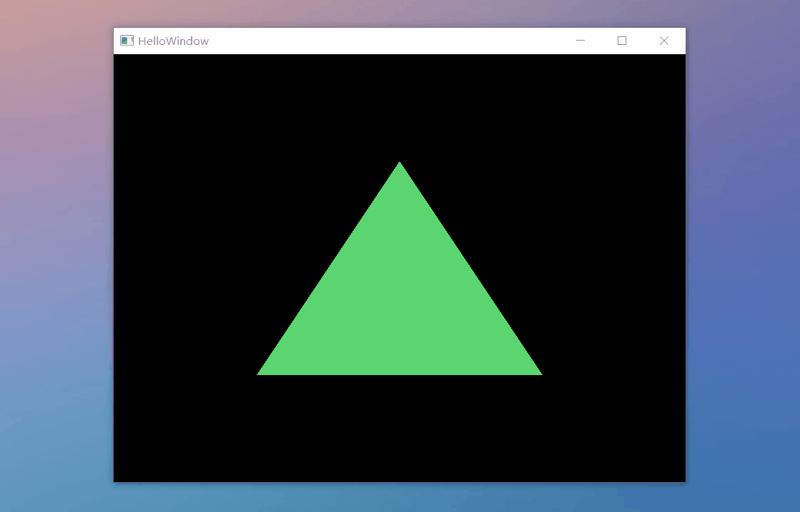

# OpenGl Lessons

    Create Window

    
    
    

    Hello, Triangle

    

    Define Shader

    
    

    Texture

    
    
    
    

    Coordinate System

    
    
    
        

    3D

    

